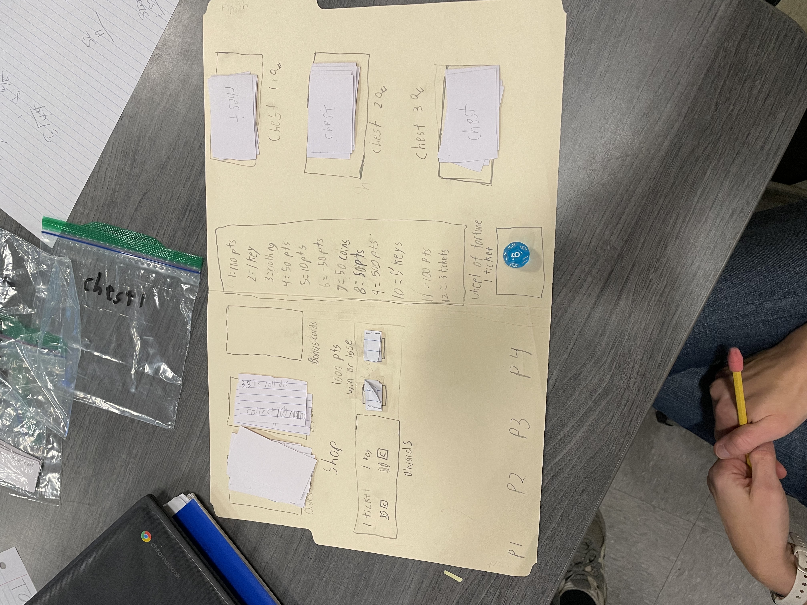

# Isaac's Board Game

A web-based math trivia board game designed by Isaac (age 10) and brought to life with Claude Code.

## Play the Game

**[Play Isaac's Board Game](https://patrickbrandt.github.io/isaac_game_1/)**

## Rules of the Game

### Objective
Be the first player to reach **1000 points**!

### Players
- 2-4 players
- Players take turns clockwise

### Turn Structure
Each player gets **3 actions** per turn. An action can be:

1. **Answer a Math Question** - Solve a math problem (+, -, ×, ÷) to earn **50 coins**
2. **Buy from the Shop** - Spend coins on keys or tickets
3. **Open a Chest** - Spend keys to earn points
4. **Spin the Wheel of Fortune** - Spend a ticket for a random reward

### The Shop
| Item | Cost |
|------|------|
| Key | 50 coins |
| Ticket | 50 coins |

### The Chests
| Chest | Keys Required | Reward |
|-------|---------------|--------|
| Chest 1 | 1 key | 50-100 points |
| Chest 2 | 2 keys | 150-200 points |
| Chest 3 | 3 keys | 250-300 points |

### Wheel of Fortune
Spend 1 ticket to spin. Roll a 12-sided die:

| Roll | Reward |
|------|--------|
| 1 | 100 points |
| 2 | 1 Key |
| 3 | Nothing |
| 4 | 50 points |
| 5 | 10 points |
| 6 | 50 points |
| 7 | 5 coins |
| 8 | 50 points |
| 9 | 500 points |
| 10 | 5 keys |
| 11 | 100 points |
| 12 | 3 tickets |

### Winning
The first player to reach **1000 points** wins!

---

## How This Game Was Created

This game started as a hand-drawn board game created by Isaac, a 10-year-old game designer. Using Claude Code, we converted his physical game into a playable web application in a single conversation.

### The Original Design

### The Q&A Process

Here's how we worked through understanding the game rules:

---

**Q: What's the goal of the game?**

> The goal of the game is to get to 1000 points. Players answer questions to earn coins to spend in the shop to buy keys to open chests that can earn more points, or buy a ticket to spin the wheel of fortune. The chest and the wheel give you points. Players take turns one at a time, clockwise.

---

**Q: What kind of questions do players answer? And how many coins do you earn for a correct answer?**

> Players answer math questions. You earn 50 coins for answering a math question correctly.

---

**Q: What do items cost in the shop?**

> 1 ticket is 50 coins, 1 key is 50 coins.

---

**Q: Do all 3 chests give the same rewards?**

> Different amounts. The first chest requires 1 key, the second 2 keys, the third 3 keys so the third has the best stuff.

---

**Q: What rewards are in each chest?**

> Chest 1 gives 50-100 points. Chest 2 gives 150-200 points. Chest 3 gives 250-300 points.

---

**Q: How does the Wheel of Fortune work?**

> You roll a 12-sided die.

---

**Q: Is there anything else about how turns work?**

> Each player gets 3 actions on their turn. An action is either answering a question, buying something in the shop, opening a chest, or spinning the wheel of fortune.

---

From this conversation, Claude Code generated a complete implementation plan and then built the entire game - HTML structure, CSS styling, and JavaScript game logic - all in one session.

## Credits

- **Game Design**: Isaac (age 10)
- **Development**: Built with [Claude Code](https://claude.com/claude-code)
